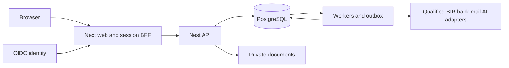

# Architecture and implementation decisions

## ADR 001 Application and repository

Select a TypeScript monorepo managed by pnpm workspaces. `apps/web` is Next.js 16 App Router; `apps/api` is NestJS 12 with explicit REST controllers; `apps/worker` runs the same domain packages as the API. Runtime baseline is Node.js 24 LTS. Use ESM consistently. Resolve supported patch versions in P00, save exact dependency versions and a frozen lockfile, and record container digests; do not install `latest` in CI. The framework documentation supports these version families, but P00 still executes the compatibility build rather than assuming it. [Node releases](https://nodejs.org/en/about/previous-releases), [Next installation](https://nextjs.org/docs/app/getting-started/installation), [Nest migration guidance](https://docs.nestjs.com/migration-guide).

PostgreSQL 18 is the system of record. Use parameterized `pg` access behind typed repositories and checked SQL migrations; monetary calculation uses decimal arithmetic, never JavaScript `number`. Schema migrations are ordered SQL files with a checksum ledger and an exclusive migration advisory lock. Implement the small migration runner in `packages/database`; do not allow application boot to mutate schemas.

UI uses React, TypeScript, Tailwind CSS and accessible Radix primitives with LARA-owned components. Use TanStack Query for authenticated client server-state and React Hook Form with generated validation schemas. Prefer URL state for filters and explicit forms over a global mutable finance store. Versions are pinned by the same P00 compatibility gate. Use Vitest for domain tests and Playwright for browser acceptance.

Shared components in `packages/ui` implement the [design and asset contract](12-design-and-assets.md): DCP interaction patterns with the approved Ledger-L theme. Copy source web assets deterministically to the application public directory; do not recreate logos or use retired concepts.

## ADR 002 Deployment shape

Start with a modular monolith, not independently deployed business microservices. Deploy web, API and workers as separate containers from one repository. Private object storage holds attachments/exports; PostgreSQL holds metadata, transactional outbox and durable jobs. No Redis, Kafka, search cluster or vector database is required for P00–P11. Introduce one only through measured evidence and an ADR.

Local development uses Docker Compose: PostgreSQL 18, a pinned Keycloak OIDC image, a private filesystem-backed development object adapter, Mailpit mail sink, API, worker and web. Production uses OIDC and an S3-compatible private storage adapter qualified for the selected hosting region. The local file adapter and mail sink are prohibited when `LARA_MODE=production`. Infrastructure modules target containers, PostgreSQL and private object storage; the actual cloud account/region is an operator input, not a software fork.

## ADR 003 Module boundaries

`identity`, `organization`, `parties`, `workflow`, `evidence`, `ledger`, `tax`, `sales`, `purchasing`, `treasury`, `compliance`, `integration`, `books`, `inventory`, `assets`, `assistant`, `portal`, `firm`, `group`, `planning`, `extensions` own their tables and application services. Cross-module writes call application services inside a passed transaction context. Controllers and workers cannot write another module's tables directly. Ledger rows are written only by PostingService; a business transaction and its journal/outbox/audit effects commit in one database transaction.

Modules expose synchronous commands/queries for same-transaction invariants and versioned events for side effects. Events never replace authoritative checks. A notification failure must not reverse a successful posting. Integrations use an outbox and repeat-safe consumers, not a database write followed by an unrecorded network request.

## ADR 004 Tenant isolation and identity

One deployment may contain many tenants. A tenant contains legal entities; entities contain branches and books. All owned rows carry `tenant_id`; entity data also carry `entity_id`. Use UUID identifiers generated server-side. Natural tax IDs are not primary keys. Use composite foreign keys including tenant/entity context to reject cross-scope references.

The BFF owns an opaque session cookie (`HttpOnly`, `Secure`, `SameSite=Lax`) and exchanges OIDC credentials server-side. Use authorization-code flow with PKCE, state and nonce. API accepts short-lived audience-bound service/user tokens from the BFF or explicitly provisioned integration clients, not browser-supplied tenant claims without membership lookup. User membership is rechecked on each mutation; authorization caches expire within 30 seconds and revocation invalidates active sessions/jobs immediately through a revocation version.

Enable and FORCE RLS on owned tables. Every request transaction sets tenant context with transaction-local settings after authentication. Use a non-owner role with no `BYPASSRLS`; background jobs use the same scope resolver. Entity/branch/record permissions are also checked in domain services. RLS is defense in depth, not the only authorization mechanism; privileged roles can bypass row policies. [PostgreSQL row security](https://www.postgresql.org/docs/18/ddl-rowsecurity.html).

## ADR 005 Consistency

Financial commands acquire locks in order: tenant/entity/book period → document → sorted affected accounts/open items → number series. The posting transaction holds a shared period lock; closing obtains an exclusive period lock. Retry serialization/deadlock errors at most three times with jitter and the same idempotency key. No network calls inside that transaction.

Use READ COMMITTED with explicit locks for normal commands, and SERIALIZABLE for operations whose cross-row predicate invariants are not covered by a locked aggregate. Recheck all business conditions after locks. All financial decimal amounts are serialized as strings. [PostgreSQL transaction isolation](https://www.postgresql.org/docs/18/transaction-iso.html).

## ADR 006 Demo isolation

P01 uses the same deployed web/API/identity patterns but a separate `demo` schema in a separate database, synthetic IDs and separate storage namespace. Demo services cannot call production PostingService or external adapters. A dedicated server setting and network egress policy select fixture providers. Production startup fails if a demo provider/reset route is registered. Demo sessions have permanent visual “Demo — synthetic data” status and exports have an invalid-for-tax watermark.

## ADR 007 Reuse and AI

Define `EvidenceStore`, `EInvoiceTransport`, `ModelGateway`, `NotificationTransport` and `SourceFeed` interfaces owned by LARA. Do not assume SyncTax/JANUS/GAIA/Daedalus API shapes exist. Each may replace a reference adapter only after contract, failure, permission, residency and support qualification. AI is optional and receives scoped draft/report tools only; deterministic finance services never depend on an available model.

## ADR 008 Regulatory configuration

Store immutable approved rule/template versions with source, legal applicability, date interval, reviewer and hash. Activation requires separate approval; no executable tenant-supplied code. Demo rate fixtures are never legal authority. External format/schema certification is an explicit activation gate; P07 defines the adapter contract so implementation can proceed against fixtures without pretending those fixtures are official.
